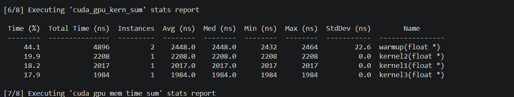

# 线程束分化测试（thread_block_divergence.cu）
明显看到warmup耗时最长  
kernel1线程束分化严重   
kernel2无线程束分化 
nsys profile --stats=true build/thread_block_divergence 256 250000
```bash
nsys profile --stats=true build/thread_block_divergence 256 66666
```

