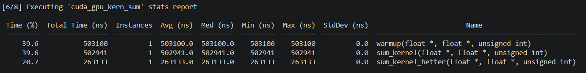
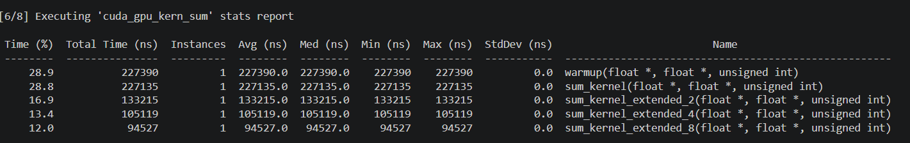

# 001-线程束分化测试（course001.cu）
sum_kernel 分化严重，线程对应内存地址，导致一个warp中有很多线程没有执行  
sum_kernel_better 经过优化，让连续的线程去找内存地址，产生更多满的warp，更多全空的warp   
sum_kernel_better_plus 在防止线程分化的基础上，同时还保持了每轮的内存访问是连续的，但是相邻归约只有第一轮的内存访问是连续的，所以交错归约比相邻归约更快
```bash
nsys profile --stats=true build/course001
```




# 002-线程束分化测试（course002.cu）
1. 尝试不同的展开  
sum_kernel cource001 中的交错归约  
sum_kernel_extended_2 每block计算2个block数据  
sum_kernel_extended_4 每block计算4个block数据  
sum_kernel_extended_8 每block计算8个block数据  
之前是将数据分为多个block_size大小的块，每一块都进行归约的整个计算，这其中包含同步，循环等等。  
但是如果一个block计算n块数据，用m条加法指令就能代替m个块的整个归约过程  



```bash
nsys profile --stats=true build/course002
```